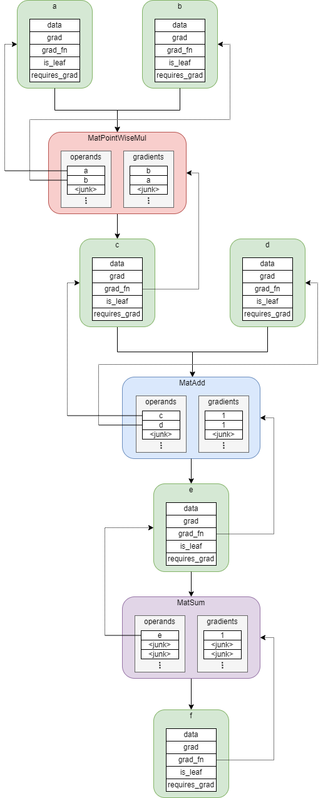

# Intro
PyTorch auto-grad mechanism implemented in Cpp (only the essential parts). More modules and functions could be easily added. 

Dependency Chain of Cpp Modules: \
**autograd** <- optims <- modules <- blocks <- funcs <- nn <- parameters

# Features
## Matrix & Tensor operations: [nn.h](./sources/includes/nn_decl.h)
Matrix: basic operations (transpose, multiplication, slice, etc.) and also neural network specific operations (softmax, normalize, position encoding, etc.) 
Tensor: built on matrix; supports gradient accumulation and back-propagation (see differentiate below)

## Functions: [funcs.h](./sources/includes/funcs_decl.h)
Includes matrix multiplication, matrix add a matrix (or a vector), matrix point-wise multiplication, sum of matrix elements, matrix scaling, point-wise Tanh and MSE loss. Each of them should have two implemented member functions: **apply** (apply the function to arguments), and **differentiate** (define how the gradient is calculated given the gradient chain delivered to it)

## Blocks: [blocks.h](./sources/includes/blocks_decl.h)
Includes linear layer implementation. More blocks (like convolution block) could be added if needed.  

## Modules: [modules.h](./sources/includes/modules_decl.h)
Includes 3-layer MLP implementation. More modules (like CNN) could be added if needed.

## Optimizers: [optims.h](./sources/includes/optims_decl.h)
The implementation of optimizer is on another computer but I have no access to it currently. This part is cleared and left blank temporarily. You are welcomed to contribute code!

# Computational Graph Example

# References
https://pytorch.org/tutorials/beginner/blitz/autograd_tutorial.html
